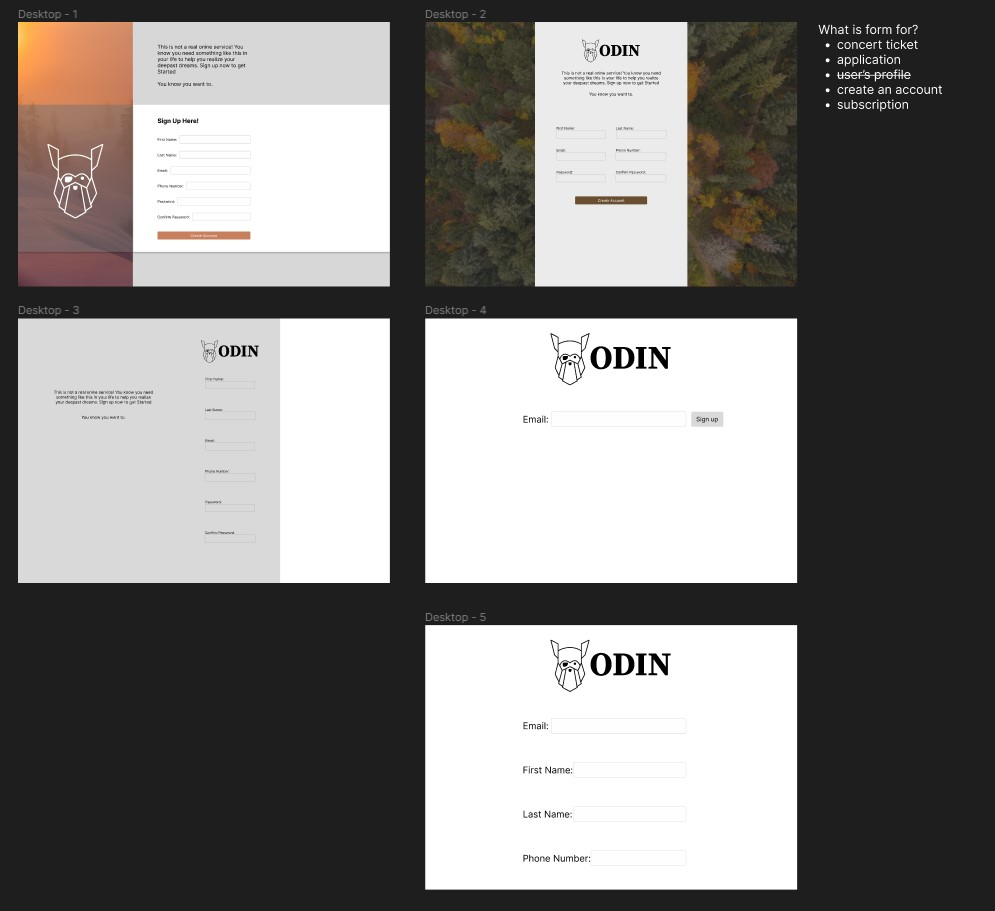
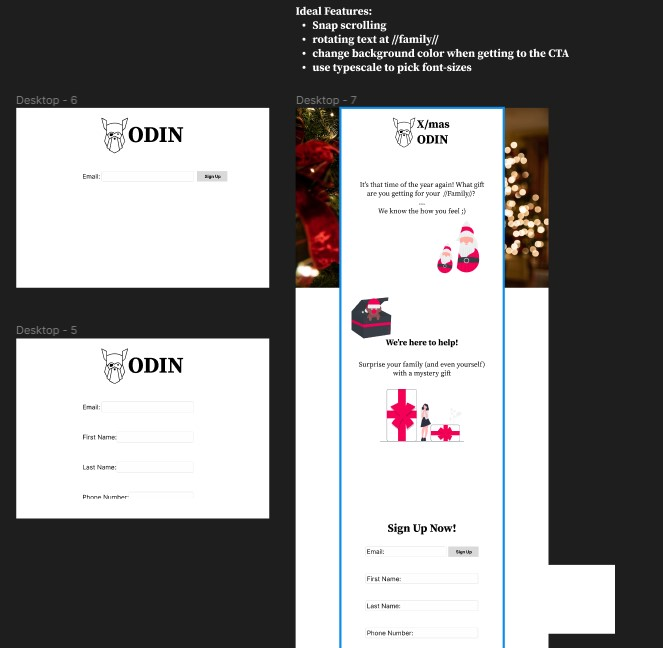

# TOP-Sign-up-Form - [Live](https://github.com/neitt0/TOP-Sign-up-Form)

## MVP
* all items(images) aligned properly
* sign up form expands after entering email

## Process
### Design Phase
I started off by brainstorming ideas for what the project would look like. First, I ask myself what this sign-up form could be used for. Then I try different layout for that purpose.

### Testing Phase
After designing, I challenged myself to implement something that would take more effort but makes my page (somewhat) stands out from the rest.
I settled for this drop-down styled where more information would appears after the user click "sign up."

### Final Design
With all of the above planned out, I put everything together and created a final mockup.

christmas background from Tessa Rampersad ([Upsplash](https://unsplash.com/@t_rampersad))
illustrations taken from [unDraw](https://undraw.co/illustrations) 